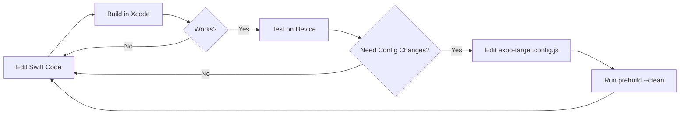

## Overview

Developing Apple Targets follows a **prebuild → develop → prebuild** cycle that leverages Continuous Native Generation to keep your project clean and reproducible.

## Initial Setup

### 1. Create Your Target

Use the interactive CLI to scaffold a new target:

```bash
npx create-target
```

Or specify the type directly:

```bash
npx create-target widget
```

This creates:
- Target directory in `/targets/<name>/`
- `expo-target.config.js` configuration
- Template Swift files
- Auto-installs `@bacons/apple-targets` if needed

### 2. Configure Your Target

Edit the generated `expo-target.config.js`:

```javascript
/** @type {import('@bacons/apple-targets/app.plugin').Config} */
module.exports = {
  type: "widget",
  icon: "./icon.png",
  colors: {
    $accent: "steelblue",
  },
  entitlements: {
    "com.apple.security.application-groups": ["group.com.example.app"],
  },
};
```

### 3. Set Your Apple Team ID

Add your Apple Team ID to `app.json`:

```json
{
  "expo": {
    "ios": {
      "appleTeamId": "TEAM123456",
      "bundleIdentifier": "com.example.app"
    }
  }
}
```

<Note>
Find your Team ID in Xcode under **Signing & Capabilities** or in your Apple Developer account settings.
</Note>

### 4. Run Prebuild

Generate the Xcode project:

```bash
npx expo prebuild -p ios --clean
```

The `--clean` flag ensures a fresh build by removing the existing `ios/` directory.

## Development Cycle

### Opening in Xcode

Open your project:

```bash
xed ios
```

You'll see the `expo:targets` folder in the project navigator:

```
Project
├── expo:targets/              ← Work here!
│   ├── widget/
│   │   ├── Widget.swift
│   │   ├── Info.plist
│   │   └── Assets.xcassets
│   └── _shared/
├── YourAppName/
└── Pods/
```

<Info>
The `expo:targets` folder is a **virtual folder** that links to `../targets/`. Changes are saved outside the `ios/` directory.
</Info>

### Making Changes

#### ✅ Safe to Edit in Xcode

- Any file inside `expo:targets/`
- Swift source files
- Asset catalogs
- Storyboards and XIBs
- Info.plist (some keys)

#### ❌ Avoid Editing in Xcode

- Build settings (use config instead)
- Target membership
- Frameworks (use `frameworks` config)
- Entitlements (use `entitlements` config)
- Bundle identifiers
- Team IDs

### Iteration Workflow



### When to Run Prebuild

Run `npx expo prebuild -p ios --clean` when you:

- **Change `expo-target.config.js`** - Bundle ID, entitlements, frameworks, etc.
- **Change `app.json`** - Bundle ID, team ID, version, etc.
- **Add/remove target directories** - New targets or deleted targets
- **Add/remove files in `_shared/`** - Shared code between targets
- **Update Expo SDK** - To regenerate with latest templates
- **Experience Xcode issues** - Fresh start can resolve corruption

<Warning>
**Do NOT** run prebuild if you only changed Swift code, assets, or Info.plist. Your changes are already saved outside `ios/`.
</Warning>

## Testing Your Target

### Building Individual Targets

In Xcode, select your target from the scheme dropdown:

```
┌─────────────────────────┐
│ YourApp (main app)     │
│ widget                 │  ← Select this
│ clip                   │
└─────────────────────────┘
```

Then build (`⌘+B`) or run (`⌘+R`).

### Testing Widgets

1. Build and run the **main app** first
2. Long-press the home screen
3. Tap the `+` button
4. Find your app's widget
5. Add to home screen

<Info>
iOS 18+ allows transforming the app icon into a widget. Long-press the app icon and select **Widget Options**.
</Info>

For SwiftUI Previews:

```swift
#Preview {
    Widget()
        .previewContext(WidgetPreviewContext(family: .systemSmall))
}
```

### Testing App Clips

App Clips require special setup:

1. **Build via TestFlight** - Local testing doesn't support deep linking
2. **Configure AASA file** - Add `.well-known/apple-app-site-association`
3. **Set up App Clip Experience** - In App Store Connect
4. **Test QR codes** - Generate with Apple's [App Clip Code Generator](https://developer.apple.com/app-clips/resources/)

See the [App Clips guide](/guides/app-clips) for detailed instructions.

### Testing Share Extensions

1. Build and run the main app
2. Open Safari or Photos
3. Tap the Share button
4. Find your extension in the share sheet
5. Test the sharing flow

## Debugging

### Console Logs

In Swift, use standard logging:

```swift
import os.log

let logger = Logger(subsystem: "com.example.app.widget", category: "Widget")
logger.info("Widget updated with data: \(data)")
```

View logs in **Console.app** or Xcode's debug console.

### Breakpoints

1. Open your Swift file in Xcode
2. Click the gutter to add a breakpoint
3. Run the target
4. Trigger the code path

For widgets, use `WidgetCenter.shared.reloadAllTimelines()` to trigger updates.

### Common Issues

<Accordion title="Widget doesn't appear on home screen">
  **Solution:**
  - Use iOS 18+ (better widget debugging)
  - Long-press app icon → Widget Options
  - Check `PRODUCT_BUNDLE_IDENTIFIER` matches
  - Verify `Info.plist` has correct widget configuration
</Accordion>

<Accordion title="Swift compiler errors in widget">
  **Solution:**
  - Clear SwiftUI previews: `xcrun simctl --set previews delete all`
  - Use blank template: `npx expo prebuild --template ./node_modules/@bacons/apple-targets/prebuild-blank.tgz`
  - Check framework imports match config
</Accordion>

<Accordion title="Changes not reflected after prebuild">
  **Solution:**
  - Ensure you edited files in `expo:targets/` folder
  - Check if files are in git (should be tracked)
  - Verify `--clean` flag was used
  - Close and reopen Xcode
</Accordion>

<Accordion title="Code signing errors">
  **Solution:**
  - Open Xcode signing tab to fix profiles
  - Verify `appleTeamId` in `app.json`
  - Check entitlements are valid
  - Use Automatic signing in Xcode first time
</Accordion>

## Advanced Workflows

### Using the Blank Template

For faster iteration without React Native:

```bash
npx expo prebuild \
  --template ./node_modules/@bacons/apple-targets/prebuild-blank.tgz \
  --clean
```

<Warning>
**Development only!** This removes React Native. Do not use for production builds or with third-party config plugins.
</Warning>

### Sharing Code with `_shared/`

Create a `_shared/` directory to share code between targets:

```
targets/
├── widget/
│   └── Widget.swift
├── clip/
│   └── ClipApp.swift
└── _shared/
    ├── DataModel.swift       ← Linked to both targets
    └── NetworkClient.swift   ← Linked to both targets
```

Global shared code:

```
targets/
├── _shared/              ← Linked to ALL targets
│   └── Constants.swift
├── widget/
└── clip/
```

<Note>
Re-run `npx expo prebuild --clean` after adding/removing files in `_shared/` directories.
</Note>

### CocoaPods Integration

Add a `pods.rb` file in your target directory:

```ruby
# targets/widget/pods.rb

pod 'Alamofire', '~> 5.9'
pod 'SwiftyJSON', '~> 5.0'
```

The plugin automatically includes it in the Podfile.

### React Native in App Clips

Set `exportJs: true` in your App Clip config:

```javascript
module.exports = {
  type: "clip",
  exportJs: true,  // Enables Metro bundler
};
```

Add a `pods.rb` to include React Native:

```ruby
require File.join(File.dirname(`node --print "require.resolve('react-native/package.json')"`), "scripts/react_native_pods")

use_expo_modules!
config = use_native_modules!

use_react_native!(
  :path => config[:reactNativePath],
  :hermes_enabled => true,
  :app_path => "#{Pod::Config.instance.installation_root}/..",
)
```

## Version Control

### What to Commit

```gitignore
# Commit these
targets/
app.json
package.json

# Don't commit these
ios/
android/
*.xcworkspace
*.xcuserstate
```

### Recommended `.gitignore`

```gitignore
# Native
ios/
android/

# Xcode
*.xcworkspace
*.xcuserstate
DerivedData/

# macOS
.DS_Store
```

## CI/CD Integration

### EAS Build

Your `eas.json` automatically works:

```json
{
  "build": {
    "production": {
      "ios": {
        "buildConfiguration": "Release"
      }
    }
  }
}
```

EAS Build automatically:
1. Runs `npx expo prebuild`
2. Installs CocoaPods
3. Builds all targets
4. Signs with provisioning profiles

<Info>
Entitlements are automatically synced to EAS credentials. See [Code Signing](/concepts/code-signing).
</Info>

### Manual CI

For custom CI (GitHub Actions, etc.):

```yaml
- name: Prebuild iOS
  run: npx expo prebuild -p ios --clean

- name: Install Pods
  run: cd ios && pod install

- name: Build
  run: xcodebuild -workspace ios/YourApp.xcworkspace -scheme YourApp
```

## Performance Tips

### Faster Builds

1. **Use Xcode schemes** - Build only the target you're testing
2. **Disable unused targets** - Comment out in `app.json` plugin config
3. **Use blank template** - For extension development
4. **Enable Hermes** - Faster JS execution in App Clips

### Faster Iteration

1. **Minimize prebuilds** - Only when config changes
2. **Use SwiftUI previews** - Test UI without building
3. **Use simulator** - Faster than device builds
4. **Cache derived data** - In CI/CD pipelines

## Next Steps

<CardGroup cols={2}>
  <Card title="Code Signing" icon="signature" href="/concepts/code-signing">
    Configure provisioning and entitlements
  </Card>
  <Card title="Widget Guide" icon="grid" href="/guides/widgets">
    Build your first home screen widget
  </Card>
</CardGroup>